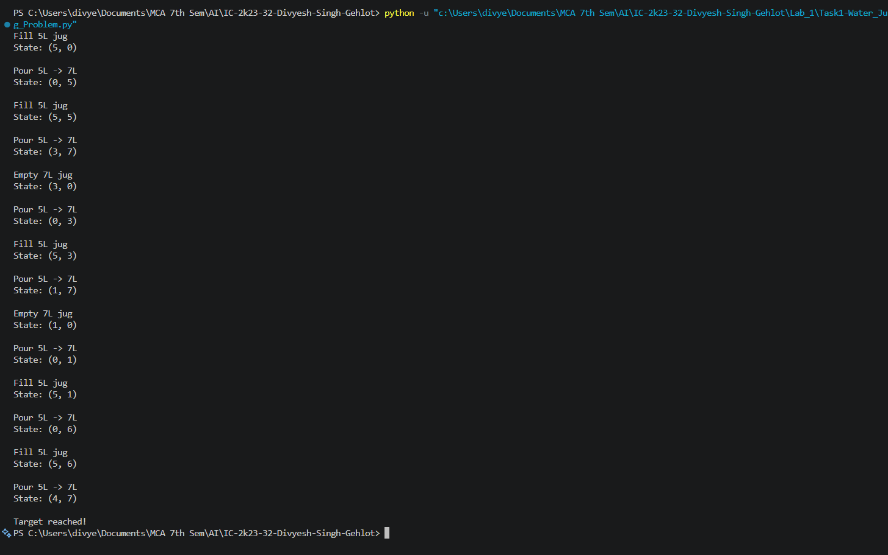
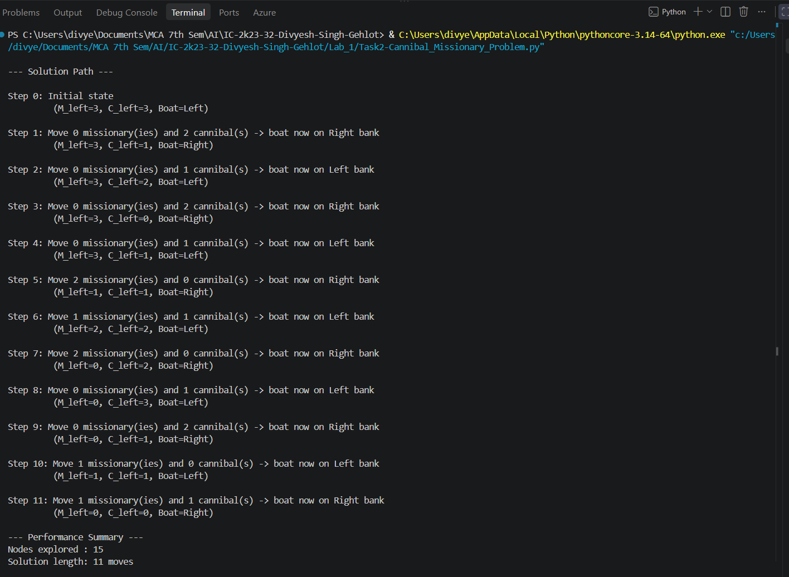
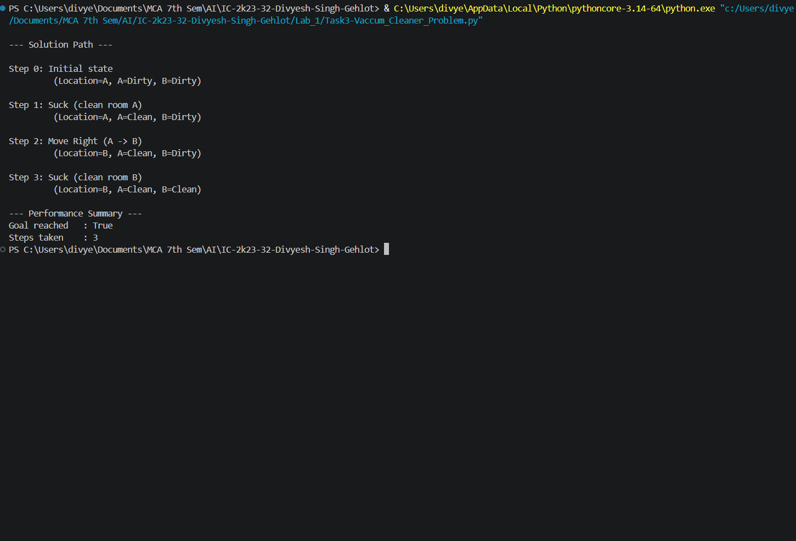

# 🧠 Lab 1 — AI Problem Formulation & Intelligent Problem Solving

## Overview

This lab implements three classic AI search / production-system problems to demonstrate **state-space representation**, **production rules**, and **rule-based decision making**:

1. Water Jug Problem
2. Missionaries and Cannibals Problem
3. Vacuum Cleaner Problem

Each problem is solved using an explicit state representation and a set of well-defined rules/operators, followed by a common Performance Analysis and a homework Analysis comparing classical vs. AI-style programming.

---

# 1. Water Jug Problem

## 1.1 Aim / Problem Statement

### Aim
To implement the **Water Jug Problem** in Python using an algorithmic approach and determine a sequence of operations that measures an exact target amount of water using two jugs of given capacities.

### Problem Statement
Given two water jugs with capacities `X` litres and `Y` litres, initially both empty, measure exactly `T` litres of water using:

1. Fill a jug completely.
2. Empty a jug completely.
3. Pour water from one jug into the other until either the source jug becomes empty or the destination jug becomes full.

### Example
```text
First Jug  = 5L
Second Jug = 7L
Target     = 4L
```

## 1.2 Algorithm

**State representation:** `(a, b)` where `a` = water in first jug, `b` = water in second jug. Initial state = `(0, 0)`.

### Pseudocode
```text
START
Set first_jug = 0
Set second_jug = 0

WHILE neither jug contains target:
    IF first_jug is empty:
        Fill first jug
    ELSE IF second_jug is full:
        Empty second jug
    ELSE:
        Pour water from first jug to second jug
    Display current state

Display "Target reached"
END
```

## 1.3 Implementation

```python
def water_jug(first_capacity, second_capacity, target):
    """
    Solve the Water Jug Problem using two jugs.

    Parameters:
        first_capacity (int): Capacity of the first jug.
        second_capacity (int): Capacity of the second jug.
        target (int): Required amount of water.
    """
    first_jug = 0
    second_jug = 0

    while first_jug != target and second_jug != target:

        if first_jug == 0:
            first_jug = first_capacity
            print(f"Fill {first_capacity}L jug")

        elif second_jug == second_capacity:
            second_jug = 0
            print(f"Empty {second_capacity}L jug")

        else:
            transferable_amount = min(first_jug, second_capacity - second_jug)
            first_jug -= transferable_amount
            second_jug += transferable_amount
            print(f"Pour {first_capacity}L -> {second_capacity}L jug")

        print(f"State: ({first_jug}, {second_jug})")
        print()


def validate_input(first_capacity, second_capacity, target):
    """Validate Water Jug Problem inputs."""
    if not isinstance(first_capacity, int):
        raise TypeError("First jug capacity must be an integer.")
    if not isinstance(second_capacity, int):
        raise TypeError("Second jug capacity must be an integer.")
    if not isinstance(target, int):
        raise TypeError("Target must be an integer.")
    if first_capacity <= 0 or second_capacity <= 0:
        raise ValueError("Jug capacities must be positive.")
    if target < 0:
        raise ValueError("Target cannot be negative.")
    if target > max(first_capacity, second_capacity):
        raise ValueError("Target cannot be greater than both jug capacities.")


def main():
    """Run the Water Jug Problem."""
    first_capacity = 5
    second_capacity = 7
    target = 4

    validate_input(first_capacity, second_capacity, target)
    water_jug(first_capacity, second_capacity, target)


if __name__ == "__main__":
    main()
```

## 1.4 Results / Output

**Input:** First Jug = 5L, Second Jug = 7L, Target = 4L

```text
Fill 5L jug
State: (5, 0)

Pour 5L -> 7L jug
State: (0, 5)

Fill 5L jug
State: (5, 5)

Pour 5L -> 7L jug
State: (3, 7)

Empty 7L jug
State: (3, 0)

Pour 5L -> 7L jug
State: (0, 3)

Fill 5L jug
State: (5, 3)

Pour 5L -> 7L jug
State: (1, 7)

Empty 7L jug
State: (1, 0)

Pour 5L -> 7L jug
State: (0, 1)

Fill 5L jug
State: (5, 1)

Pour 5L -> 7L jug
State: (0, 6)

Fill 5L jug
State: (5, 6)

Pour 5L -> 7L jug
State: (4, 7)

Target reached!
```

**Result:** Target of 4 litres reached. Final state: `(4, 7)`.

## 1.5 Performance Analysis

| Metric | Result |
|---|---|
| Accuracy / Precision / Recall / F1 / Confusion Matrix | Not Applicable (not a classification problem) |
| Number of Operations | 13 |
| Time Complexity | O(N) |
| Space Complexity | O(1) |

Classification metrics don't apply here since the algorithm performs deterministic state transitions rather than predicting labels — relevant measures instead are number of operations, states generated, and time/space complexity.

## 1.6 Screenshots / State Visualization

```text
(0,0) → (5,0) → (0,5) → (5,5) → (3,7) → (3,0) → (0,3) → (5,3)
→ (1,7) → (1,0) → (0,1) → (5,1) → (0,6) → (5,6) → (4,7)
```


---

# 2. Missionaries and Cannibals Problem

## 2.1 Aim / Problem Statement

### Aim
To implement the **Missionaries and Cannibals Problem** using Breadth-First Search (BFS) over an explicit state space, and find a safe sequence of boat crossings.

### Problem Statement
3 missionaries and 3 cannibals must cross a river using a boat that holds at most 2 people. On neither bank may cannibals ever outnumber missionaries (if any missionaries are present). Find a sequence of crossings that gets everyone across safely.

## 2.2 Algorithm

**State representation:** `(missionaries_left, cannibals_left, boat_position)`, where `boat_position = 1` means the boat is on the left bank, `0` means the right bank.

- **Initial state:** `(3, 3, 1)`
- **Goal state:** `(0, 0, 0)`
- **Production rules (operators):** move `(1,0)`, `(2,0)`, `(0,1)`, `(0,2)`, or `(1,1)` people across the river, applied only `IF` the resulting state keeps missionaries safe on both banks.

### Pseudocode
```text
START
Initialize start_state = (3, 3, boat=Left)
Initialize queue with start_state, mark visited

WHILE queue is not empty:
    current = dequeue()
    IF current is goal state:
        RETURN path to current

    FOR each possible move (m, c) in {(1,0),(2,0),(0,1),(0,2),(1,1)}:
        new_state = apply move to current
        IF new_state is valid AND not visited:
            mark visited
            enqueue new_state with parent = current

RETURN no solution
END
```

## 2.3 Implementation

```python
"""
Missionaries and Cannibals Problem
Solved using Breadth-First Search (BFS)
"""

from collections import deque


class State:
    """Represents a state in the search space."""

    def __init__(self, missionaries_left, cannibals_left, boat_left, parent=None, move=None):
        self.m_left = missionaries_left
        self.c_left = cannibals_left
        self.boat_left = boat_left
        self.parent = parent
        self.move = move  # (missionaries_moved, cannibals_moved)

    def is_valid(self):
        """Check if a state is valid (no missionaries get eaten)."""
        if self.m_left < 0 or self.c_left < 0:
            return False
        if self.m_left > 3 or self.c_left > 3:
            return False

        m_right = 3 - self.m_left
        c_right = 3 - self.c_left

        if self.m_left > 0 and self.m_left < self.c_left:
            return False
        if m_right > 0 and m_right < c_right:
            return False

        return True

    def is_goal(self):
        return self.m_left == 0 and self.c_left == 0 and self.boat_left == 0

    def __eq__(self, other):
        return (self.m_left == other.m_left and
                self.c_left == other.c_left and
                self.boat_left == other.boat_left)

    def __hash__(self):
        return hash((self.m_left, self.c_left, self.boat_left))

    def __repr__(self):
        return f"(M_left={self.m_left}, C_left={self.c_left}, Boat={'Left' if self.boat_left else 'Right'})"


def get_successors(state):
    """Generate all valid successor states from the current state."""
    successors = []
    possible_moves = [(1, 0), (2, 0), (0, 1), (0, 2), (1, 1)]
    direction = -1 if state.boat_left == 1 else 1

    for m, c in possible_moves:
        new_m_left = state.m_left + direction * m
        new_c_left = state.c_left + direction * c
        new_boat_left = 0 if state.boat_left == 1 else 1

        new_state = State(new_m_left, new_c_left, new_boat_left, parent=state, move=(m, c))

        if new_state.is_valid():
            successors.append(new_state)

    return successors


def bfs_solve():
    """Solve the problem using Breadth-First Search."""
    start_state = State(3, 3, 1)
    visited = set()
    queue = deque([start_state])
    visited.add(start_state)

    nodes_explored = 0

    while queue:
        current_state = queue.popleft()
        nodes_explored += 1

        if current_state.is_goal():
            return current_state, nodes_explored

        for successor in get_successors(current_state):
            if successor not in visited:
                visited.add(successor)
                queue.append(successor)

    return None, nodes_explored


def reconstruct_path(goal_state):
    """Trace back from goal state to start state to get the solution path."""
    path = []
    state = goal_state
    while state is not None:
        path.append(state)
        state = state.parent
    path.reverse()
    return path


def print_solution(path):
    """Print the solution in a readable step-by-step format."""
    print("\n--- Solution Path ---\n")
    for i, state in enumerate(path):
        bank = "Left" if state.boat_left else "Right"
        if state.move is not None:
            m, c = state.move
            print(f"Step {i}: Move {m} missionary(ies) and {c} cannibal(s) -> boat now on {bank} bank")
        else:
            print(f"Step {i}: Initial state")
        print(f"         {state}\n")


def main():
    """Run the Missionaries and Cannibals Problem."""
    try:
        goal_state, nodes_explored = bfs_solve()

        if goal_state is None:
            print("No solution found.")
            return

        path = reconstruct_path(goal_state)
        print_solution(path)

        print("--- Performance Summary ---")
        print(f"Nodes explored : {nodes_explored}")
        print(f"Solution length: {len(path) - 1} moves")

    except Exception as e:
        print(f"An error occurred while solving the problem: {e}")


if __name__ == "__main__":
    main()
```

## 2.4 Results / Output

```text
--- Solution Path ---

Step 0: Initial state
         (M_left=3, C_left=3, Boat=Left)

Step 1: Move 0 missionary(ies) and 2 cannibal(s) -> boat now on Right bank
         (M_left=3, C_left=1, Boat=Right)

Step 2: Move 0 missionary(ies) and 1 cannibal(s) -> boat now on Left bank
         (M_left=3, C_left=2, Boat=Left)

Step 3: Move 0 missionary(ies) and 2 cannibal(s) -> boat now on Right bank
         (M_left=3, C_left=0, Boat=Right)

Step 4: Move 0 missionary(ies) and 1 cannibal(s) -> boat now on Left bank
         (M_left=3, C_left=1, Boat=Left)

Step 5: Move 2 missionary(ies) and 0 cannibal(s) -> boat now on Right bank
         (M_left=1, C_left=1, Boat=Right)

Step 6: Move 1 missionary(ies) and 1 cannibal(s) -> boat now on Left bank
         (M_left=2, C_left=2, Boat=Left)

Step 7: Move 2 missionary(ies) and 0 cannibal(s) -> boat now on Right bank
         (M_left=0, C_left=2, Boat=Right)

Step 8: Move 0 missionary(ies) and 1 cannibal(s) -> boat now on Left bank
         (M_left=0, C_left=3, Boat=Left)

Step 9: Move 0 missionary(ies) and 2 cannibal(s) -> boat now on Right bank
         (M_left=0, C_left=1, Boat=Right)

Step 10: Move 0 missionary(ies) and 1 cannibal(s) -> boat now on Left bank
         (M_left=0, C_left=2, Boat=Left)

Step 11: Move 0 missionary(ies) and 2 cannibal(s) -> boat now on Right bank
         (M_left=0, C_left=0, Boat=Right)

--- Performance Summary ---
Nodes explored : 15
Solution length: 11 moves
```

**Result (in words):** send 2 cannibals across → 1 cannibal back → 2 cannibals across → 1 cannibal back → 2 missionaries across → 1 missionary + 1 cannibal back → 2 missionaries across → 1 cannibal back → 2 cannibals across → 1 cannibal back → last 2 cannibals across. Everyone crosses safely in 11 moves.

## 2.5 Performance Analysis

| Metric | Result |
|---|---|
| Accuracy / Precision / Recall / F1 / Confusion Matrix | Not Applicable (search problem, not classification) |
| Nodes Explored | 15 |
| Solution Length (moves) | 11 |
| Search Strategy | BFS — guarantees shortest solution (optimal for uniform-cost moves) |
| Time Complexity | O(b^d) where b = branching factor, d = solution depth |
| Space Complexity | O(b^d) (BFS stores all visited/frontier states) |

## 2.6 Screenshots


---

# 3. Vacuum Cleaner Problem

## 3.1 Aim / Problem Statement

### Aim
To implement the **Vacuum Cleaner Problem** as a production-rule-based simple reflex agent that cleans a two-room world.

### Problem Statement
A vacuum agent operates in a world of two rooms, A and B, each either Dirty or Clean. The agent can Suck (clean the current room) or Move to the other room. Starting from any configuration, the agent must reach a state where both rooms are Clean, using the minimum number of actions.

## 3.2 Algorithm

**State representation:** `(location, status_A, status_B)` where `location ∈ {A, B}` and `status_A, status_B ∈ {Dirty, Clean}` — 8 possible states in total.

**Production rules:**
```text
RULE 1: IF current room is Dirty          THEN Suck
RULE 2: IF current room is Clean AND at A THEN Move Right
RULE 3: IF current room is Clean AND at B THEN Move Left
```

### Pseudocode
```text
START
Set current_state = initial (location, status_A, status_B)

WHILE NOT (status_A = Clean AND status_B = Clean):
    IF current room is Dirty:
        Suck (clean current room)
    ELSE IF at room A:
        Move Right to B
    ELSE:
        Move Left to A
    Record state and action

Display "Goal reached"
END
```

## 3.3 Implementation

```python
"""
Vacuum Cleaner Problem
Solved using a Production Rule System (Simple Reflex Agent)
"""


class State:
    """Represents a state of the vacuum world."""

    def __init__(self, location, status_a, status_b):
        self.location = location
        self.status_a = status_a
        self.status_b = status_b

    def is_goal(self):
        """Goal state: both rooms are clean."""
        return self.status_a == "Clean" and self.status_b == "Clean"

    def current_status(self):
        """Return the dirt status of the room the vacuum is currently in."""
        return self.status_a if self.location == "A" else self.status_b

    def __repr__(self):
        return f"(Location={self.location}, A={self.status_a}, B={self.status_b})"


def apply_rule(state):
    """
    Production rules for the vacuum agent:
    RULE 1: IF current room is Dirty          THEN Suck
    RULE 2: IF current room is Clean AND at A THEN Move Right
    RULE 3: IF current room is Clean AND at B THEN Move Left
    """
    if state.current_status() == "Dirty":
        if state.location == "A":
            return State("A", "Clean", state.status_b), "Suck (clean room A)"
        else:
            return State("B", state.status_a, "Clean"), "Suck (clean room B)"

    elif state.location == "A":
        return State("B", state.status_a, state.status_b), "Move Right (A -> B)"

    else:
        return State("A", state.status_a, state.status_b), "Move Left (B -> A)"


def solve_vacuum(start_state, max_steps=20):
    """Run the production system until the goal state is reached."""
    trace = [(start_state, "Initial state")]
    current_state = start_state
    steps_taken = 0

    while not current_state.is_goal() and steps_taken < max_steps:
        next_state, action = apply_rule(current_state)
        trace.append((next_state, action))
        current_state = next_state
        steps_taken += 1

    return trace, steps_taken, current_state.is_goal()


def print_solution(trace):
    """Print the step-by-step trace of states and actions."""
    print("\n--- Solution Path ---\n")
    for i, (state, action) in enumerate(trace):
        print(f"Step {i}: {action}")
        print(f"         {state}\n")


def main():
    """Run the Vacuum Cleaner Problem."""
    try:
        start_state = State("A", "Dirty", "Dirty")
        trace, steps_taken, goal_reached = solve_vacuum(start_state)

        print_solution(trace)

        print("--- Performance Summary ---")
        print(f"Goal reached   : {goal_reached}")
        print(f"Steps taken    : {steps_taken}")

    except Exception as e:
        print(f"An error occurred while solving the problem: {e}")


if __name__ == "__main__":
    main()
```

## 3.4 Results / Output


```text
--- Solution Path ---

Step 0: Initial state
         (Location=A, A=Dirty, B=Dirty)

Step 1: Suck (clean room A)
         (Location=A, A=Clean, B=Dirty)

Step 2: Move Right (A -> B)
         (Location=B, A=Clean, B=Dirty)

Step 3: Suck (clean room B)
         (Location=B, A=Clean, B=Clean)

--- Performance Summary ---
Goal reached   : True
Steps taken    : 3
```

**Result:** Starting with both rooms dirty and the agent in room A, the goal (both rooms clean) is reached in 3 actions: Suck → Move Right → Suck.

## 3.5 Performance Analysis

| Metric | Result |
|---|---|
| Accuracy / Precision / Recall / F1 / Confusion Matrix | Not Applicable (reflex agent, not classification) |
| Steps to Goal (A=Dirty, B=Dirty, start=A) | 3 |
| Steps to Goal (A=Clean, B=Dirty, start=A) | 2 |
| Steps to Goal (A=Clean, B=Clean, start=A) | 0 |
| Time Complexity | O(1) per action (constant-time rule lookup) |
| Space Complexity | O(1) (no memory of past states needed — pure reflex agent) |

## 3.6 Screenshot


---

# 4. Consolidated Performance Analysis (All Three Problems)

| Problem | Approach | State Space Size | Steps/Nodes | Time Complexity | Space Complexity |
|---|---|---|---|---|---|
| Water Jug | Deterministic state iteration | Depends on jug capacities | 13 operations | O(N) | O(1) |
| Missionaries & Cannibals | BFS over state space | ≤ 4×4×2 = 32 states | 15 nodes explored, 11 moves | O(b^d) | O(b^d) |
| Vacuum Cleaner | Simple reflex agent (production rules) | 8 states | 3 actions (worst case) | O(1) per action | O(1) |

**Observation:** as problems move from a single deterministic sequence (Water Jug) to a full search over a state space (Missionaries & Cannibals) to a reactive rule-based agent (Vacuum Cleaner), the *representation and search strategy* change even though all three share the same underlying idea — a state, a set of legal operators/rules, and a goal test.

---

# 5. Analysis (Homework)

## 5.1 Compare Classical Programming and AI Programming

| Aspect | Classical Programming | AI Programming (this lab) |
|---|---|---|
| Input → Output relationship | Programmer explicitly codes the exact sequence of steps for every input | Programmer defines states, rules, and a goal test; the *solution path* is discovered by the program itself (e.g. BFS search) |
| Flexibility | Breaks or needs rewriting if the problem changes slightly (e.g. new jug sizes require re-deriving the sequence by hand) | Generalizes automatically — changing the start/goal state or jug capacities still works with the same algorithm |
| Where the "intelligence" lives | Entirely in the programmer's up-front logic | Partly in the programmer's rules, partly in the search/inference process that explores possibilities the programmer didn't explicitly enumerate |
| Determinism | Always follows one fixed procedure | May explore many candidate states/paths before committing to a solution |
| Example from this lab | A hardcoded sequence of pours for one specific jug pair | The same BFS solver works for any missionaries/cannibals count or any jug capacities without modification |

**Conclusion:** classical programming solves *one instance* of a problem via a fixed procedure, while the AI approach used here (state-space representation + search/production rules) solves an entire *class* of problem instances by describing what a solution looks like (states, rules, goal) and letting the algorithm find it.

## 5.2 Analyze Different AI Problem Formulations

All three problems were formulated using the same general components — **initial state, actions/operators, transition model, goal test, and (implicitly) path cost** — but the formulations differ in important ways:

- **Water Jug** — a *single-path* deterministic formulation. There's no branching search; the algorithm always picks the next fixed operation (fill/empty/pour) according to a strict rule order, so no exploration of alternative paths is needed.
- **Missionaries & Cannibals** — a *search-based* formulation. Multiple actions are legal from each state, so the problem is formulated as a graph of states to be explored (here via BFS), with an explicit `is_valid()` constraint check to prune unsafe states.
- **Vacuum Cleaner** — an *agent-based/reflex* formulation. Rather than searching ahead, the problem is formulated as condition–action rules applied directly to the current percept (the dirt status of the current room), with no lookahead or memory of past states required.

**Key takeaway:** the choice of formulation depends on the nature of the problem — deterministic problems don't need search, problems with branching choices and safety constraints benefit from explicit state-space search, and problems solvable by immediate local rules can use a lightweight reflex agent instead of full search. Picking the right formulation avoids unnecessary computational overhead (e.g. running BFS on the Vacuum Cleaner problem would be correct but wasteful, since the greedy rule-based approach already finds an optimal-length solution here).

---

# 6. Coding Standards Followed

- **Modular and reusable code:** each problem's logic is separated into small functions/classes (`water_jug()`, `State`/`get_successors()`/`bfs_solve()`, `apply_rule()`/`solve_vacuum()`).
- **Meaningful names:** `first_capacity`, `missionaries_left`, `status_a`, etc., instead of single-letter variables.
- **Comments & docstrings:** every function has a docstring explaining its purpose, parameters, and return values.
- **Exception handling:** input validation (Water Jug) and `try/except` blocks around the main solving logic (all three) prevent crashes on invalid input.
- **PEP-8 compliance:** 4-space indentation, `snake_case` naming, consistent spacing, and functions kept to a single responsibility.

---

# 7. Learning Outcomes

- Understood how to represent real-world problems as formal **states**, **operators**, and **goal tests**.
- Implemented three different solving strategies: deterministic iteration, uninformed search (BFS), and a reflex production-rule agent.
- Learned to distinguish when search is necessary versus when direct rule application suffices.
- Practiced measuring **algorithmic performance** (nodes explored, steps taken, time/space complexity) as an alternative to ML-style metrics.
- Understood the conceptual difference between **classical/procedural programming** and **AI-style problem formulation**.
- Applied clean coding practices: modular functions, docstrings, input validation, and PEP-8 formatting.

---

# 8. Conclusion

This lab implemented the Water Jug, Missionaries and Cannibals, and Vacuum Cleaner problems using explicit state-space representations and production rules. Water Jug was solved via a deterministic iterative procedure, Missionaries and Cannibals via BFS over a validated state graph, and the Vacuum Cleaner via a simple reflex production-rule agent. Together, the three problems demonstrate the core building blocks of classical AI problem solving — state representation, operators/rules, and goal-directed behavior — and illustrate how the right formulation and search strategy depend on the structure of the problem itself.